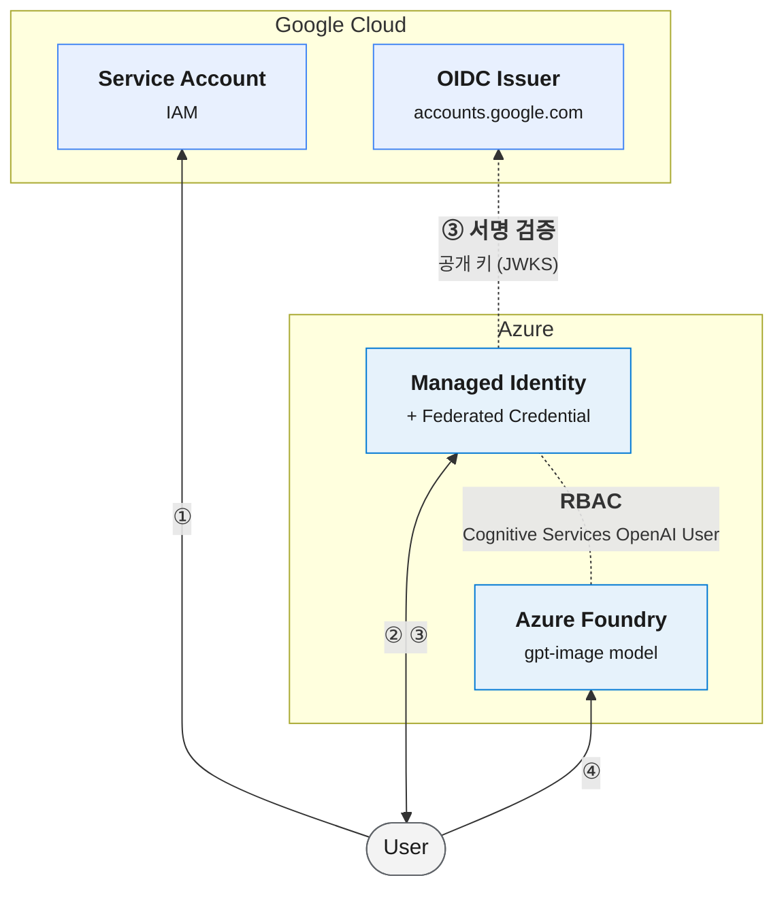
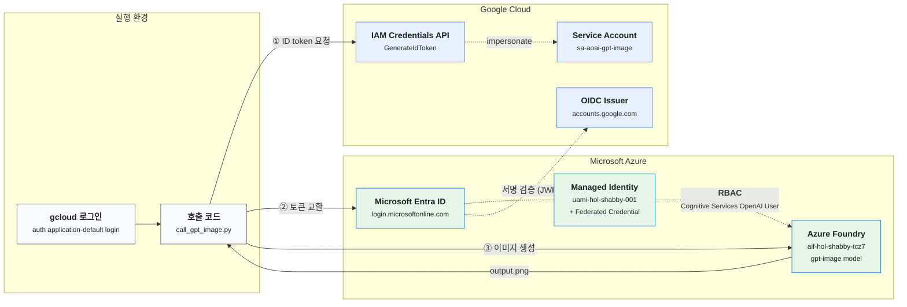

# GCP Service Account 로 Azure Foundry gpt-image 모델 호출하기

GCP Service Account 가 발급한 Google ID token 을 Microsoft Entra ID 토큰으로 교환해, **API key 없이** Azure Foundry 의 `gpt-image` 모델을 호출합니다.



1. User 가 GCP Service Account 의 Google ID token 을 받습니다. audience 는 `api://AzureADTokenExchange` 입니다.
2. User 가 이 토큰을 Microsoft Entra ID 로 보내 Managed Identity 의 access token 을 요청합니다.
3. Entra ID 는 Google(Issuer)의 공개 키로 토큰 서명을 검증하고, claim(issuer, subject, audience)이 Managed Identity 의 Federated Credential 에 등록된 값과 일치하는지 확인하고, User 에게 access token 을 발급합니다.
4. User 는 이 access token 으로 Azure Foundry 의 `gpt-image` 모델을 호출합니다. Foundry 는 Managed Identity 에 할당된 `Cognitive Services OpenAI User` 역할로 권한을 확인합니다.


## 목차

1. [GCP — Service Account 생성](#1-gcp--service-account-생성)
2. [Azure — Managed Identity 와 Federated Credential](#2-azure--managed-identity-와-federated-credential)
3. [Azure — Foundry 에 역할 할당](#3-azure--foundry-에-역할-할당)
4. [GCP — Token Creator 권한 부여](#4-gcp--token-creator-권한-부여)
5. [호출](#5-호출)
6. [로그 확인](#6-로그-확인)
   - [Entra ID — 토큰 교환](#entra-id--토큰-교환)
   - [GCP — ID token 발급](#gcp--id-token-발급)
7. [기타 도구](#7-기타-도구)

## 1. GCP — Service Account 생성

**GCP Console → IAM & Admin → Service Accounts → + Create service account**


Service account name (예: `sa-aoai-gpt-image`) 을 입력하고 **Create and continue**.


**Permissions** 는 비워 두고 **Continue**. 이 SA 에는 GCP 리소스 권한이 필요 없습니다.

> Permissions 에 Service Account Token Creator 를 넣지 마세요. 여기서 고른 역할은 SA 가 *받는* 권한입니다. 필요한 것은 사용자가 이 SA 를 impersonate 하는 권한이며 [4단계](#4-gcp--token-creator-권한-부여)에서 부여합니다.


**Principals with access** 도 비워 두고 **Done**.


생성된 SA 을 선택해 상세 화면으로 넘어갑니다.


SA 상세 화면에서 **Unique ID** 를 복사합니다. Google ID token 의 `sub` 가 이 값이며, 2단계 Federated Credential 의 Subject identifier 에 들어갑니다.


## 2. Azure — Managed Identity 와 Federated Credential

Portal 검색창에서 **Managed Identities**.


**+ Create**.


Resource group, Name, Region 을 입력하고 **Review + create**.


생성된 Managed Identity 의 **Settings → Federated credentials → + Add Credential**.


Federated credential scenario 는 **Other**.


| 필드 | 값 |
|---|---|
| Issuer URL | `https://accounts.google.com` |
| Subject identifier | [1단계](#1-gcp--service-account-생성)에서 복사한 SA 의 **Unique ID** |
| Name | 임의 (예: `gcp-sa-aoai-gpt-image`) |
| Audience | `api://AzureADTokenExchange` |


## 3. Azure — Foundry 에 역할 할당

Portal 검색창에서 **Foundry**.


`gpt-image` 모델이 있는 Foundry 리소스 → **Access control (IAM) → + Add → Add role assignment**.


Role: **Cognitive Services OpenAI User**.


Members: **+ Select members** → [2단계](#2-azure--managed-identity-와-federated-credential)의 Managed Identity 선택 → **Select** → **Review + assign**. 역할 전파에 최대 5분이 걸릴 수 있습니다.


## 4. GCP — Token Creator 권한 부여

이 저장소는 로컬에서 사용자 GCP 계정으로 `gpt-image` 모델 호출을 테스트합니다. 사용자 계정이 SA 를 impersonate 하므로, 그 사용자에게 SA 에 대한 역할을 부여해야 합니다. 만약 Cloud Run / Cloud Functions / GCE 에서 실행한다면, 이 단계 대신 런타임의 Service account 를 [1단계](#1-gcp--service-account-생성)의 SA 로 지정하면 됩니다.

SA 상세 화면에서 **Principals with access → Grant access** 를 선택합니다.


**New principals 에 사용자 계정 추가, Role 에 Service Account Token Creator** → **Save**. 프로젝트 Owner 여도 이 역할은 별도로 필요합니다.


## 5. 호출



> 테스트를 위해 Foundry 리소스의 inbound 네트워크를 **public access** 로 설정했습니다. [`infra/`](#infra--terraform) 도 같은 설정(`allowed_ip_ranges` 미지정 시 모든 네트워크 허용)으로 구성됩니다. 엔터프라이즈 환경에서는 조직의 네트워크 보안 정책에 맞춰 허용 IP 제한(`allowed_ip_ranges`), Private Endpoint, VPN / Interconnect 등으로 변경해야 합니다.

로그인합니다. 스크립트는 이 계정(ADC)으로 SA 를 impersonate 합니다.

```bash
gcloud auth application-default login
```

[python/call_gpt_image.py](python/call_gpt_image.py) 를 실행합니다.

```bash
cd python && uv run call_gpt_image.py --sa <SA ID> --project <project ID> --tenant-id <tenant ID> --client-id <Managed Identity Client ID> --endpoint https://<foundry-name>.openai.azure.com
```

| 인자 | 값 |
|---|---|
| `--sa` | 1단계의 Service account ID (예: `sa-aoai-gpt-image`) |
| `--project` | GCP **project ID** (예: `mark-test-001-423712`). 생략하면 gcloud 기본 project 를 사용하며, 표시 이름과 다를 수 있으니 지정을 권장합니다. |
| `--tenant-id` | [6단계](#6-로그-확인) Microsoft Entra ID → Overview 의 **Tenant ID** |
| `--client-id` | [2단계](#2-azure--managed-identity-와-federated-credential) Managed Identity Overview 의 **Client ID** |
| `--endpoint` | foundry project 내 `gpt-image` 모델 endpoint |
| `--deployment` | `gpt-image` 모델 배포 이름 (기본값 `gpt-image-2.5-flare`) |
| `--prompt` | 프롬프트 (선택) |
| `--output` | 저장 파일 (기본값 `output.png`) |

Cloud Run / Functions / GCE 에서는 파일 ① 단계의 주석에 있는 metadata server 호출로 바꿉니다.

## 6. 로그 확인

### Entra ID — 토큰 교환

**Microsoft Entra ID → Monitoring → Sign-in logs**.


**Managed identity sign-ins** 탭에서 Managed Identity 이름으로 확인합니다. User / Service principal sign-ins 탭에는 나오지 않습니다.


상세 화면의 **Client credential type** 이 `Federated identity credential` 이면 Google ID token 으로 교환된 것입니다.


### GCP — ID token 발급

**Logs Explorer** 에서 `GenerateIdToken` 으로 조회합니다. `principalEmail` 에 impersonate 한 사용자, `request.name` 에 대상 SA, `audience` 에 `api://AzureADTokenExchange` 가 남습니다.


## 7. 기타 도구

### `scripts/decode-jwt.sh` — 토큰 claim 확인

SA 명의의 Google ID token 을 발급받아 claim 을 출력합니다. project ID 를 생략하면 gcloud 기본 project 를 사용합니다. `sub` 가 SA 의 Unique ID 와 같은지, `aud` 가 `api://AzureADTokenExchange` 인지 확인할 때 씁니다. Federated Credential 불일치 오류(`AADSTS70021`)를 확인할 때 유용합니다. 서명은 검증하지 않습니다.

```bash
scripts/decode-jwt.sh <SA ID> <project ID>
# 출력
{
  "iss": "https://accounts.google.com",
  "sub": "<SA unique ID>",
  "aud": "api://AzureADTokenExchange",
  "email": "<SA email>",
  "iat": "2026-09-22T08:53:11Z",
  "exp": "2026-09-22T09:53:11Z"
}
```

### `infra/` — Terraform

> **참고용**입니다. 운영 환경에 그대로 적용하기보다는 조직의 명명 규칙, 네트워크, 보안 정책에 맞춰 수정해 사용하세요.

1~4단계를 Portal / Console 대신 Terraform 으로 한 번에 구성합니다. 기존 리소스를 쓰지 않고 **새로 생성**합니다.

- GCP: Service Account, IAM Service Account Credentials API
- Azure: Resource group, Foundry(API key 비활성), `gpt-image-2.5-flare` 배포, Managed Identity, Federated Credential(SA Unique ID 자동 연결), `Cognitive Services OpenAI User` 역할

```bash
cp infra/terraform.tfvars.example infra/terraform.tfvars
```

```bash
terraform -chdir=infra init
```

```bash
terraform -chdir=infra apply
```

사용자에 대한 Token Creator 역할은 만들지 않으므로 [4단계](#4-gcp--token-creator-권한-부여)는 직접 진행합니다. 5단계 인자로 쓸 값은 output 으로 확인합니다.

```bash
terraform -chdir=infra output
```
